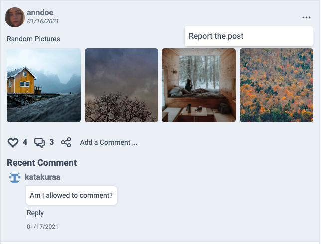

# Social Network Side Project

```md
  
  The Project was developed using following technologies:
    
    - Go        (Image Processing Service: Resize, Blur, Delete, and Host)
    - NodeJs    (Apollo GraphQL Server)
    - NextJs    (Apollo GraphQL Client)
    - MongoDB   (Primary Database)
    - Redis     (Jobs, JWT Blacklisting)
    - Varnish   (Http Cashing)
    - NGINX     (Reverse Proxy, Layer 7 Load balancer (round robin))
    - Docker    (Virtualization)

  Deployed on Single instance DigitalOcean droplet with 1GB of RAM and 25GB storage,
  Also, I had increase the SWAP up to 2GB.

```

## Architecture


## Welcome Page


## Personalized Feed


## Post Shallow Render (CSR) and Actions


## Post Detail Render (SSR)


## Post Card And Actions





## User Profile


## Traveler Mode


